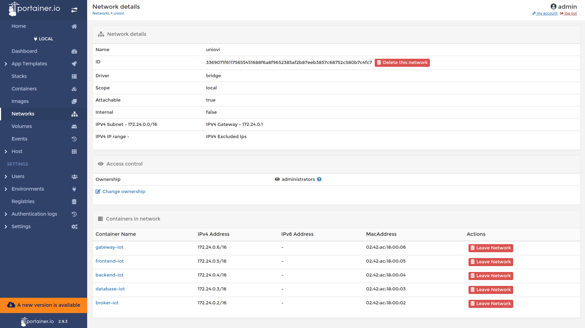

# Description
IoT Deployment Uniovi PoC

## Create and start service
```shell
docker-compose up -d
```

## Stop service
```shell
docker-compose stop
```

## Restart service
```shell
docker-compose start
```

## Remove service resources
```shell
docker-compose down
```

## Get service logs
```shell
docker-compose logs
```

## Some PoC IoT UIs

- **Uniovi network** from [portainer](https://localhost:9443) we could check the uniovi network



- **API Explorer** from [Loopback Explorer](http://localhost:3000/explorer) we could check the backend API


- **node-RED Designer** from [node-RED Designer](http://localhost:1880) we could check the iot flows:


- **node-RED Dashboard** from [IoT Dashboard](http://localhost:1880/ui) we could check the iot sensors graphs:
 


- **node-RED Dashboard** from [IoT Dashboard](http://localhost:1880/ui) we could check the iot sensors historic:
 
